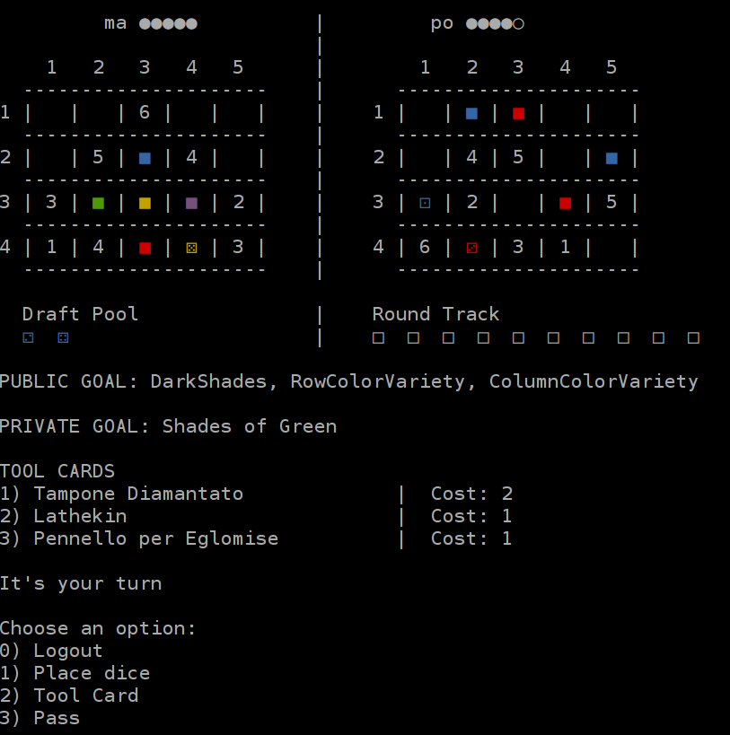
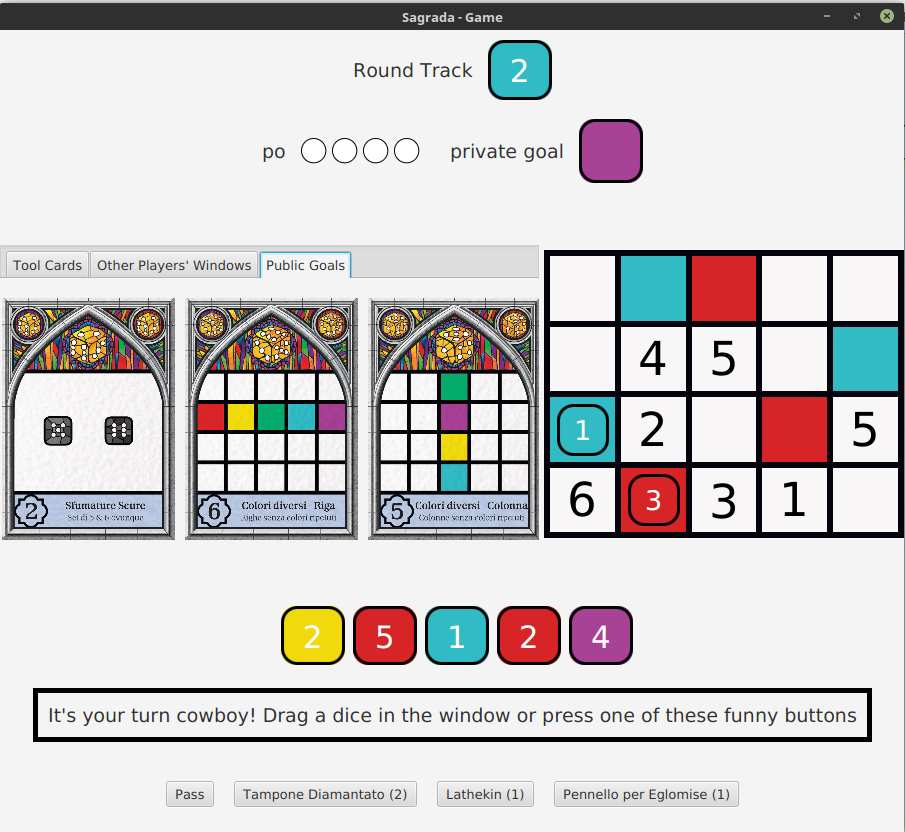

# Sagrada-ingsw-g49
repository for software engineering final examination, group 49, development of Sagrada board game

**Members**
- Arduini Mario
- Bellante Armando
- Casarotto Marco

Link to [rules](sagrada-info/sagrada_regole_ITA.pdf)

## Features

- Server can spawn **multiple games in parallel** (up to 4 players per game)
- Server can **handles in-game disconnections** and subsequent reconnections
- Client supports connection through **Socket** or **RMI**  
- Client supports graphical **Swing UI** and **CLI-based UI**  
- No external libraries except for testing,ui and json parsing were allowed (in particular **no client-server connection handling**)

## Try the project

To try the project follow this instrucions: (Java 8 or higher is required)  
- Head to Deliverables folder
- Run Server.jar (`java -jar Server.jar` or similar), enter a valid socket port for listening (eg `31333`)
- Run at least 2 clients (a game will automatically start after a timeout)
  - You can use `java -jar Client.jar -g cli` to run the program on the CLI, select socket or rmi as connection mode then enter `localhost` and also the port previously selected if you are using socket, finally login with any credentials   
  - You can use `java -jar Client.jar -g gui` to run the program on the GUI, select socket or rmi as connection mode then enter `localhost` and also the port previously selected if you are using socket, finally login with any credentials   
- Enjoy the game!
